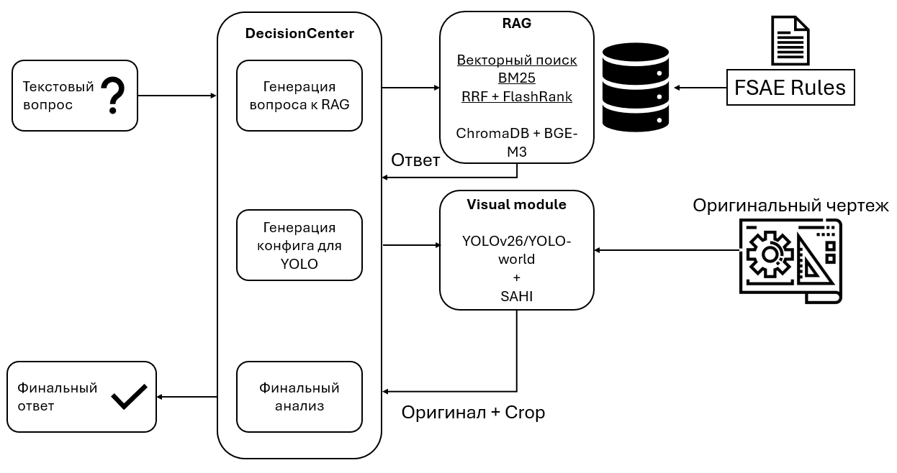

# AI-агент для проверки инженерных чертежей FSAE

Агент принимает вопрос о соответствии 2D-чертежа правилам FSAE и возвращает обоснованный ответ `Yes/No`. Он объединяет гибридный поиск по правилам (RAG), детекцию объектов на чертежах (YOLO) и мультимодальную языковую модель (Gemma4) в единый пайплайн.

Проект выполнен в рамках НИР в ИТМО. Оценка проводилась на бенчмарке [DesignQA](https://github.com/anniedoris/design_qa) — 1451 вопрос по 6 подмножествам.

---

## Предпосылки исследования

Ручной анализ инженерных чертежей на соответствие спецификациям и нормативным документам требует значительных временных затрат. Предполагается, что в результате применения ИИ-агента специалисты смогут снизить время на анализ, учет и систематизацию информации, которая содержится в инженерной документации, что позволит сосредоточить временные ресурсы, в первую очередь, на реализации более приоритетных задач, требующих экспертного суждения. 

**Гипотеза:** AI-агент, со структурой специализированой для работы с инженерными чертежами и нормативной документации, обеспечивает улучшение качества ответов на задачи датасета DesignQA по сравнению с текущим VLM бенчмарком.

**Результат:** агент на локальной модели Gemma4 получил общий балл на уровне ~0.493, что не подтвердает гипотезу.

---

## Быстрый старт

### Требования

- Python 3.10+
- [Ollama](https://ollama.com) с моделью `gemma4:e4b`
- CUDA GPU 
- 16 GB RAM

### Установка

```bash
git clone https://github.com/Nirvana-onlv/AI_agent_FSAE.git
cd AI_agent_FSAE
pip install -r requirements.txt
```

Скачайте модель через Ollama:

```bash
ollama pull gemma4:e4b
```

### Запуск агента

```python
from agent import ScrutineerPipeline
import pandas as pd

pipeline = ScrutineerPipeline(
    pdf_path="path/to/FSAE_Rules_2024_V1.pdf"
)

answer = pipeline.process_question(
    question="Does our design comply with rule V.1.2?",
    image_path="path/to/drawing.jpg",
    question_number=1
)
print(answer)
```

При первом запуске агент автоматически парсит PDF и строит ChromaDB-индекс (~3–5 минут).

---

## Архитектура

Обработка вопроса проходит три шага, каждый из которых управляется `DecisionCenter` (Gemma4):



**Три режима финального анализа:**

| Режим | Условие | Входные данные |
|---|---|---|
| Текстовый | Изображение не предоставлено | RAG-контекст + вопрос |
| Визуальный без YOLO | Ошибка детекции | Оригинал чертежа + RAG + вопрос |
| Полный | Детекция прошла успешно | Оригинал чертежа + YOLO-кроп + RAG + вопрос |

### Ключевые решения в RAG

- **Чанкинг по номерам правил** — регулярным выражением `[A-Z]{1,2}\.\d+(?:\.\d+){0,2}[a-zA-Z]?` PDF разбивается на чанки по заголовкам правил (до трёх уровней вложенности: `F.3.2.1g`)
- **Трёхступенчатый fallback** при поиске конкретного правила: векторный поиск → поиск по родительскому правилу → BM25
- **Гибридный поиск** для семантических запросов: BM25 + векторный → RRF → FlashRank reranker (веса 0.6/0.4)

---

## Результаты

Оценка на [DesignQA](https://github.com/anniedoris/design_qa) по официальной методике авторов датасета.

### Сравнение с бенчмарк-моделями

| Модель | Retrieval (F1 BoW) | Compilation (F1 Rules) | Definition (F1 BoC) | Presence (Accuracy) | Dimension (Accuracy) | Functional (Accuracy) | **Overall** |
|---|---|---|---|---|---|---|---|
| **AI-агент (наш)** | **0.944** | 0.120 | 0.378 | 0.565 | 0.450 | 0.500 | **0.493** |
| GPT-4-AllRules | 0.750 | 0.298 | 0.470 | 0.629 | 0.533 | 0.563 | — |
| GPT-4o-AllRules | 0.881 | **0.424** | **0.540** | **0.726** | **0.825** | **0.938** | — |
| Gemini-1.0-RAG | 0 (сбой) | 0.283 | 0.488 | 0.548 | 0.525 | 0.438 | — |
| Claude-Opus-RAG | 0.173 | 0.288 | 0.423 | 0.500 | 0.508 | 0.875 | — |


### Definition по категориям упоминания

| Категория | F1 BoC |
|---|---|
| Definition (компонент определён в правилах) | 0.495 |
| Mentioned (упоминается в правилах) | 0.364 |
| No-mention (не встречается в правилах) | 0.295 |

### Presence по категориям упоминания

| Категория | Accuracy |
|---|---|
| Definition (компонент определён в правилах) | 0.500 |
| Mentioned (упоминается в правилах) | 0.575 |
| No-mention (не встречается в правилах) | 0.600 |

---

## Структура проекта

```
AI_agent_FSAE/
├── Agent_notebook.ipynb          # Основной ноутбук с пайплайном агента
├── preparing_data.xlsx           # Подготовка данных для оценки
├── final_results.txt             # Итоговые результаты оценки DesignQA
├── requirements.txt
├── assets/                       # Изображения для README
├── data/                         # Подмножества датасета DesignQA
│   ├── rule_compliance/
│   │   ├── rule_dimension_qa/
│   │   │   ├── context/          # Вопросы с контекстом (direct + scale-bar)
│   │   │   └── detailed_context/ # Вопросы с детальным контекстом
│   │   └── rule_functional_performance_qa/
│   │       └── images/           # Изображения FEA-симуляций
│   └── rule_comprehension/
│       ├── rule_definition_qa/   # Изображения CAD с розовой подсветкой
│       └── rule_presence_qa/     # Изображения CAD (close-up + 6 видов)
├── experiment_results/
│   └── logs/                     # JSON-логи по каждому вопросу (q_1.json, ...)
└── fsae_chroma/                  # ChromaDB индекс (создаётся автоматически)
```

### Формат лога

Каждый вопрос сохраняется в `logs/q_{N}.json`:

```json
{
  "question_number": 1,
  "timestamp": "2026-06-01 12:00:00",
  "input": {"question": "...", "image_path": "..."},
  "intermediate_steps": {
    "rag": {"search_query": "V.1.2", "retrieved_context": [...]},
    "yolo_config_parsed": {"detection_model": "YOLOv26", "keywords": [...]},
    "founded_objects": "dimension line, arrowhead"
  },
  "final_answer": "Explanation: ...\nAnswer: Yes",
  "status": "success"
}
```

---

## Воспроизведение оценки

```bash
# 1. Клонируйте датасет DesignQA
git clone https://github.com/anniedoris/design_qa.git

# 2. Запустите агент на всех вопросах (через Eval_answers.ipynb)
# 3. Подготовьте CSV для каждого подмножества (скрипт в Eval_answers.ipynb)
# 4. Запустите официальный скрипт оценки
python design_qa/eval/full_evaluation.py \
  --path_to_retrieval    designqa_eval/rule_extraction_rule_retrieval_qa.csv \
  --path_to_compilation  designqa_eval/rule_extraction_rule_compilation_qa.csv \
  --path_to_definition   designqa_eval/rule_comprehension_rule_definition_qa.csv \
  --path_to_presence     designqa_eval/rule_comprehension_rule_presence_qa.csv \
  --path_to_dimension    designqa_eval/dimension_combined.csv \
  --path_to_functional_performance designqa_eval/rule_functional_performance_qa_rule_functional_performance_qa.csv \
  --save_path            designqa_eval/final_results.txt
```

---

## Ограничения

- **Compilation** — RAG с `rag_k ≤ 30` не может вернуть все 30+ правил которые требуют compilation-вопросы. Модели AllRules (весь документ в контекст) в данной категории имеют преимущество.
- **YOLO в zero-shot режиме** — открытый словарь YOLO-World/YOLOv26 плохо работает с инженерной терминологией. Для улучшения необходимо дообучение на чертежах.
- **Scale-bar вопросы** — вычисление размеров через масштабную линейку требует пространственного рассуждения, которое Gemma4 выполняет ненадёжно.

---

## Датасет

[DesignQA](https://github.com/anniedoris/design_qa) — 1451 вопрос по правилам FSAE, разбитых на 6 подмножеств: Retrieval, Compilation, Definition, Presence, Dimension, Functional Performance.

---

## Лицензия

MIT
